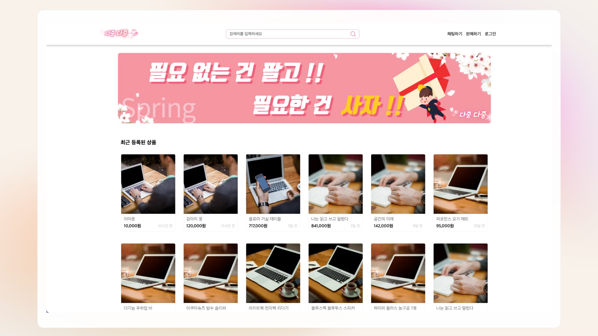
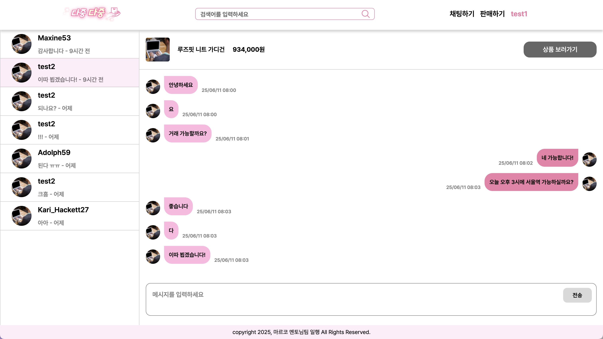

 
 

# 🎯 프로젝트 개요

다중다중은 **중고거리 플랫폼** 입니다.

<!-- 서비스 : <a href="https://www.fundmates.shop/" target="_blank">펀드 메이트 (현재는 서버 종료)</a> -->

 
 

## 👥 개발 기간 및 팀원

- 개발 기간 : 2025/05 - 2025/06 (1개월)
- 팀원 소개 : 프론트 4명 / 백 4명

 
 

## 📜 주요 기능

우리 서비스의 핵심 기능은 2가지입니다.

- 중고 **`상품 등록/조회`**
- 실시간 거래를 위한 **`채팅`**

 
 

## 📺 화면 구성

|               메인 페이지                |
| :--------------------------------------: |
|  |

|               채팅 페이지                |
| :--------------------------------------: |
|  |

 
 

## 🔬 기술 스택

| 기술 스택          | 설명                                                                          | 로고                                                                                                                         |
| ------------------ | ----------------------------------------------------------------------------- | ---------------------------------------------------------------------------------------------------------------------------- |
| **React**          | 컴포넌트 기반 재사용성과 유지보수가 좋은 라이브러리 도구                      |                     |
| **Tailwind CSS**   | Tailwind의 빠른 스타일링을 위해 사용                                          |   |
| **TypeScript**     | JavaScript에 정적 타입을 추가하여 사전 오류 방지                              |       |
| **TanStack-query** | 서버 상태 관리를 간편하게 해주며, 데이터 패칭, 캐싱 및 동기화를 자동으로 처리 |  |
| **Jest**           | 빠르고 직관적인 테스트 환경 제공                                              |                         |

 
